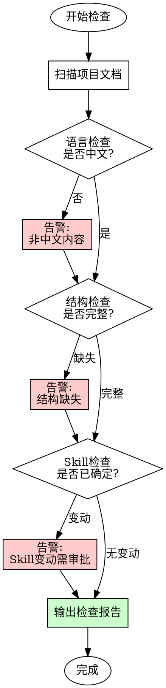
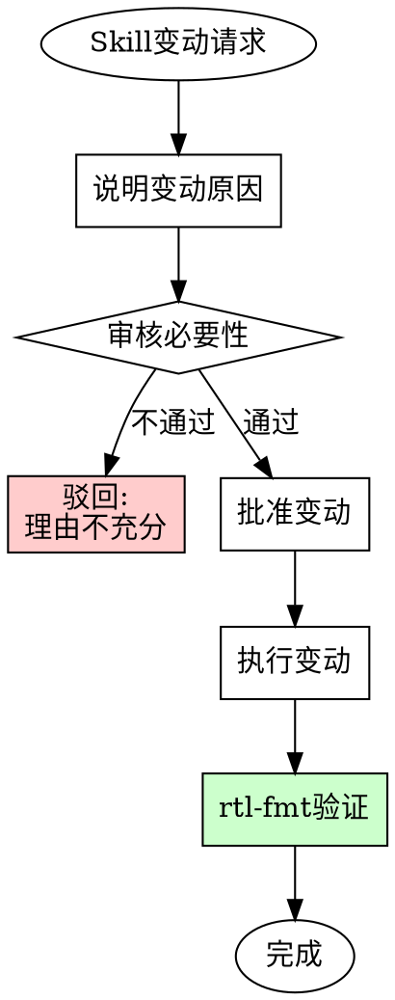
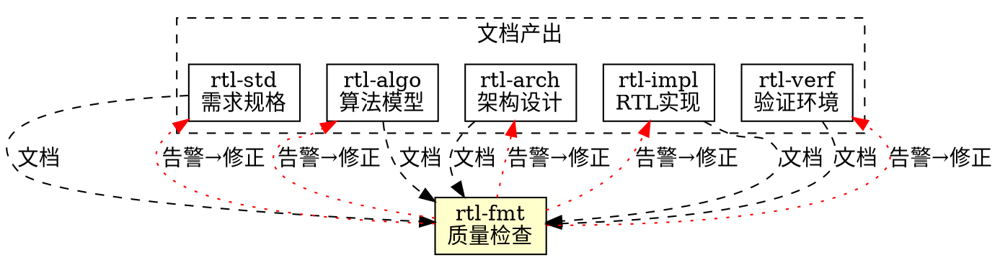

# RTL 文档质量检查 (rtl-fmt)

## 概述

**保证项目文档输出质量，强制中文文档规范。**

**核心原则：** 统一语言，统一格式，统一质量标准。Skill 一经确定不可随意改动。

## 触发条件

**必须执行：**
- 新建文档后
- 修改文档后
- 定期质量检查
- 交付前审核

**触发关键词：**
- "检查文档质量"
- "文档格式检查"
- "验证文档规范"
- "质量检查"

## 强制规则

### 铁律

```
所有项目文档必须使用中文书写
Skill 确定后不可随意改动
```

**文档范围：**
- `.claude/skills/*/SKILL.md` - Skill 定义文档
- `docs/` - 项目文档目录
- `README.md` - 项目说明
- 其他 `.md` 文档

**例外：**
- 代码文件（`.v`, `.sv`, `.py` 等）代码部分
- 配置文件（`.json`, `.yaml` 等）
- 第三方引用文档

### 质量检查项

| 检查项 | 要求 | 处理方式 |
|--------|------|----------|
| 语言 | 中文书写 | 非中文内容告警 |
| YAML frontmatter | name + description | 缺失则告警 |
| 概述章节 | 必须有核心原则 | 缺失则告警 |
| 触发条件 | 明确何时使用 | 缺失则告警 |
| 代码示例 | 中文注释 | 非中文注释则告警 |
| 结构完整 | 符合模板要求 | 缺失则告警 |

## 检查流程



## 告警机制

### 告警格式

```
[rtl-fmt 告警] 文档质量检查发现以下问题：

┌─────────────────────────────────────────────────────────────┐
│ 文件: <文件路径>                                             │
│ 问题: <问题描述>                                             │
│ 类型: <语言/结构/Skill变动>                                   │
│ 责任Skill: <应负责修正的skill>                                │
│ 建议: <修正建议>                                              │
└─────────────────────────────────────────────────────────────┘
```

### 责任Skill映射

| 文档类型 | 责任Skill | 职责 |
|----------|-----------|------|
| `rtl-algo/SKILL.md` | rtl-algo | 算法工程文档 |
| `rtl-arch/SKILL.md` | rtl-arch | 架构设计文档 |
| `rtl-impl/SKILL.md` | rtl-impl | RTL实现文档 |
| `rtl-verf/SKILL.md` | rtl-verf | 验证环境文档 |
| `rtl-std/SKILL.md` | rtl-std | 需求规格文档 |
| `docs/spec/*.md` | rtl-std | 模块规格文档 |
| `docs/algo/*.md` | rtl-algo | 算法分析文档 |
| `docs/arch/*.md` | rtl-arch | 架构设计文档 |
| `docs/verif/*.md` | rtl-verf | 验证文档 |
| 其他文档 | 对应职能skill | 根据内容确定 |

### 告警示例

```
[rtl-fmt 告警] 文档质量检查发现以下问题：

┌─────────────────────────────────────────────────────────────┐
│ 文件: .claude/skills/rtl-algo/SKILL.md                      │
│ 问题: 第15行包含英文内容 "This skill guides..."             │
│ 类型: 语言                                                   │
│ 责任Skill: rtl-algo                                          │
│ 建议: 请 rtl-algo 将该段落翻译为中文                         │
└─────────────────────────────────────────────────────────────┘

┌─────────────────────────────────────────────────────────────┐
│ 文件: docs/spec/edge_detector_spec.md                       │
│ 问题: 缺少"性能指标"章节                                     │
│ 类型: 结构                                                   │
│ 责任Skill: rtl-std                                           │
│ 建议: 请 rtl-std 补充性能指标章节                            │
└─────────────────────────────────────────────────────────────┘
```

## Skill 变动管理

### 变动规则

**Skill 一经确定，不可随意改动。**

以下情况需要审批：
- 修改 SKILL.md 内容
- 删除已有 skill
- 更改 skill 职责范围

### 变动审批流程



### 变动告警

```
[rtl-fmt 严重告警] 检测到 Skill 变动！

┌─────────────────────────────────────────────────────────────┐
│ 文件: .claude/skills/rtl-xxx/SKILL.md                       │
│ 变动类型: 内容修改                                           │
│ 状态: 未审批                                                 │
│ 要求:                                                        │
│   1. 说明变动原因                                            │
│   2. 获得审批后才能执行                                      │
│   3. 如无充分理由，请恢复原内容                              │
└─────────────────────────────────────────────────────────────┘
```

## 检查报告模板

```markdown
# RTL 文档质量检查报告

## 检查时间
[日期时间]

## 检查范围
- Skills: rtl-algo, rtl-arch, rtl-impl, rtl-verf, rtl-std
- 文档: docs/ 目录下所有 .md 文件

## 检查结果汇总

| 类别 | 检查数 | 通过 | 告警 | 状态 |
|------|--------|------|------|------|
| Skills | X | X | X | ✓/✗ |
| 规格文档 | X | X | X | ✓/✗ |
| 算法文档 | X | X | X | ✓/✗ |
| 架构文档 | X | X | X | ✓/✗ |
| 验证文档 | X | X | X | ✓/✗ |

## 告警详情

### 告警 #1
- **文件**: [文件路径]
- **问题**: [问题描述]
- **责任Skill**: [skill名称]
- **状态**: 待处理

### 告警 #2
...

## 后续行动
1. [责任Skill] 请在 [时间] 前修正 [问题]
2. ...

## 签核
- 检查人: _________________
- 日期: _________________
```

## 技术术语规范

允许保留英文的技术术语：

| 类别 | 保留英文 | 中文说明 |
|------|----------|----------|
| 协议 | AXI-Stream, APB, AHB | 总线协议 |
| 结构 | FIFO, RAM, ROM | 存储结构 |
| 算法 | Sobel, Canny, IIR | 算法名称 |
| 单位 | MHz, mW, ns | 计量单位 |
| 信号 | clk, rst_n, valid | 信号名称 |
| 工具 | Verilog, SystemVerilog | 语言名称 |

## 与其他 Skill 的关系



## 执行检查清单

- [ ] 扫描所有项目文档
- [ ] 检查每个文档的语言规范
- [ ] 检查结构完整性
- [ ] 检查是否有 Skill 未审批变动
- [ ] 输出检查报告
- [ ] 向责任 Skill 发出告警
- [ ] 跟踪告警处理状态

## 铁律

```
1. 文档必须中文书写
2. Skill 不可随意改动
3. 告警必须响应处理
4. 未通过检查不得交付
```

**违反以上规则 = 质量不合格，责令整改。**