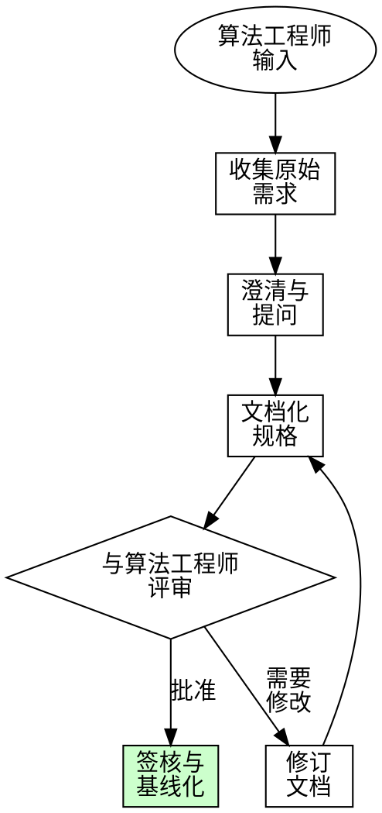
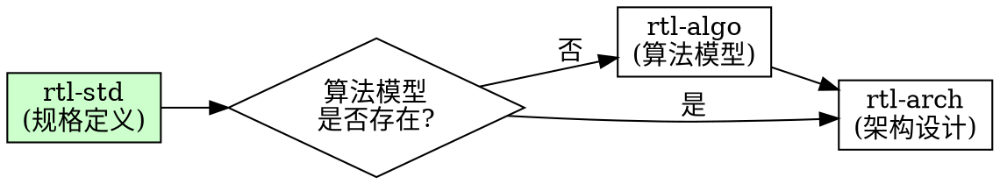

# RTL 模块规格定义 (rtl-std)

## 概述

**连接算法需求与RTL实现的桥梁。**

**核心原则：** 完整、文档化的需求防止昂贵的返工。每个假设都是潜在的bug。

本 skill 指导与算法工程师沟通，在设计开始前捕获、整理并文档化模块需求。

## 使用时机

**必须在以下 skill 之前执行：**
- rtl-arch（架构设计）
- rtl-algo（算法模型开发）
- rtl-impl（RTL实现）

**触发条件：**
- 启动新RTL模块设计
- 算法工程师提供新需求
- 将算法转换为硬件
- 创建设计规格文档
- 定义模块接口和性能目标

**不适用于：**
- 实现细节（使用 rtl-impl）
- 架构决策（使用 rtl-arch）
- 验证规划（使用 rtl-verf）

## 职能边界

**rtl-std 只管"需求是什么"，不管"如何实现"：**

| 属于 rtl-std 职责 | 不属于 rtl-std 职责 |
|------------------|-------------------|
| 定义输入输出数据格式 | 指定内部信号位宽 |
| 定义目标频率、工艺约束 | 流水线划分 |
| 定义功能需求 | 定点化方案 |
| 定义接口协议 | 存储架构设计 |
| 定义性能目标 | 模块层次划分 |

**关键原则：**
- 描述**功能阶段**，而非**流水线级数**
- 定义**时序约束**（目标频率、工艺节点），而非**流水线边界**
- 明确**性能目标**，而非**实现方案**

## 铁律

```
没有完整规格，不进行RTL设计
```

跳过需求收集？停止。先文档化假设。

**无例外：**
- 不在接口定义前开始编码
- 不假设"与之前项目类似"
- 不跳过性能目标验证
- 不在算法工程师签核前推进

## 需求收集流程



## 模块规格模板

### 1. 模块概述

```markdown
## 模块: [模块名称]

### 目的
[一句话描述模块功能]

### 流水线位置
[该模块在整体数据流中的位置]

### 主要功能
- [功能1]
- [功能2]
```

### 2. 接口规格

| 信号 | 方向 | 位宽 | 描述 | 协议 |
|------|------|------|------|------|
| clk | 输入 | 1 | 系统时钟 | - |
| rst_n | 输入 | 1 | 低有效复位 | - |
| din_valid | 输入 | 1 | 数据有效 | 握手 |
| din_ready | 输出 | 1 | 准备接收 | 握手 |
| din_data | 输入 | [DW-1:0] | 输入数据 | - |
| dout_valid | 输出 | 1 | 输出有效 | 握手 |
| dout_ready | 输入 | 1 | 下游准备 | 握手 |
| dout_data | 输出 | [DW-1:0] | 输出数据 | - |

### 3. 数据格式规格

```markdown
### 输入数据格式
- 位宽: [N位]
- 格式: [无符号/有符号/定点 Qm.n]
- 范围: [最小值 到 最大值]
- 帧结构: [描述]

### 输出数据格式
- 位宽: [N位]
- 格式: [无符号/有符号/定点 Qm.n]
- 范围: [最小值 到 最大值]
```

### 4. 性能目标

| 指标 | 要求 | 单位 |
|------|------|------|
| 吞吐量 | [N] | 像素/时钟 |
| 延迟 | [N] | 时钟周期 |
| 工作频率 | [N] | MHz |
| 面积目标 | [N] | 门/LUT |
| 功耗预算 | [N] | mW |

### 5. 算法到RTL映射

| 算法操作 | RTL实现 | 流水阶段 |
|----------|---------|----------|
| 操作A | 组合逻辑 | 阶段1 |
| 操作B | 流水乘累加 | 阶段2-3 |
| 操作C | 状态机 | 阶段4 |

## 向算法工程师提问清单

### 功能需求

1. **数据处理**
   - 输入数据格式和范围是什么？
   - 期望的输出格式是什么？
   - 是否有特殊情况或边界条件？

2. **算法细节**
   - 能否提供伪代码或流程图？
   - 哪些操作是串行的，哪些是并行的？
   - 操作之间是否有数据依赖？

3. **精度要求**
   - 需要的最小精度是多少？
   - 是否有溢出/下溢处理要求？
   - 应使用什么舍入模式？

### 性能需求

1. **吞吐量**
   - 每时钟周期处理多少样本？
   - 是否需要背压处理？
   - 可接受的突发行为是什么？

2. **延迟**
   - 最大可接受延迟？
   - 是否需要固定延迟？
   - 延迟是否可以根据数据变化？

3. **时序**
   - 目标时钟频率？
   - 是否有时钟域穿越要求？
   - 同步要求是什么？

### 集成需求

1. **接口**
   - 是否使用标准接口（AXI-Stream、APB等）？
   - 是否有自定义接口要求？
   - 是否需要配置寄存器接口？

2. **控制**
   - 是否需要启动/停止控制？
   - 模式选择要求？
   - 状态报告要求？

## 数据流伪代码模板

```python
# 模块: [模块名称]
# 描述: [简要描述]

def module_process(input_data, config):
    """
    数据流伪代码，供算法工程师验证。

    参数:
        input_data: [描述]
        config: [配置参数]

    返回:
        output_data: [描述]
    """

    # 阶段1: [描述]
    stage1_result = operation_1(input_data)

    # 阶段2: [描述]
    stage2_result = operation_2(stage1_result)

    # 阶段N: [描述]
    output_data = operation_n(stage_n_minus_1_result)

    return output_data

# 使用示例:
# input_data = [测试值]
# expected_output = [期望值]
# actual_output = module_process(input_data, default_config)
# assert actual_output == expected_output
```

## 需求签核检查清单

进入架构设计前必须完成：

- [ ] 模块目的明确定义
- [ ] 所有接口信号已文档化
- [ ] 输入/输出数据格式已指定
- [ ] 性能目标已量化
- [ ] 精度要求已文档化
- [ ] 算法伪代码已由算法工程师评审
- [ ] 边界情况已识别并指定处理方式
- [ ] 集成需求已文档化
- [ ] 假设已明确列出
- [ ] 已获得算法工程师签核

**有缺失项？停止并在推进前澄清。**

## 常见借口

| 借口 | 现实 |
|------|------|
| "需求显而易见" | 对谁显而易见？还是要文档化。 |
| "与之前项目类似" | 差异导致bug。文档化具体内容。 |
| "算法工程师很忙" | 错误需求花费更多时间。安排会议。 |
| "我能推断出接口" | 未文档化的接口导致集成失败。 |
| "性能目标是灵活的" | 灵活 = 需求不清晰。获取具体数字。 |
| "只需开始编码" | 没有规格编码 = 后期返工。 |
| "算法工程师已经解释过了" | 记忆会淡忘，误解会增加。文档化它。 |
| "我会把规格写在代码注释里" | 代码注释 ≠ 正式规格。创建规格文档。 |
| "这只是个小修改" | 修改需要更新规格。文档化变更。 |
| "规格在算法规格里" | 论文 ≠ 实现规格。提取并验证。 |
| "我理解算法" | 理解 ≠ 文档化需求。写下来。 |
| "我们可以稍后细化需求" | 后期变更 = 返工。现在搞清楚。 |

## 红旗警告 - 停止并澄清

- 没有文档化接口就开始设计
- 未经确认就假设数据格式
- 规格中出现"我认为"或"可能"
- 缺少性能数值
- 没有算法工程师签核
- 精度要求未指定
- 边界情况未讨论
- 仅依赖口头需求
- "我稍后文档化"
- 跳过签核评审
- 没有列出假设就推进

**以上所有情况意味着：停止。收集需求。获取签核。**

## 输出产物

完成 rtl-std 后，产出：

1. **模块规格文档** (`docs/spec/[模块名称]_spec.md`)
   - 完整接口定义
   - 性能需求
   - 数据格式规格

2. **数据流伪代码** (`docs/spec/[模块名称]_pseudocode.md`)
   - 算法级描述
   - 供算法工程师评审

3. **需求追溯矩阵**（可选）
   - 链接需求到设计决策
   - 追踪需求变更

## 阶段转换

rtl-std 完成后：



- **如果算法模型不存在：** 使用 rtl-algo 开发定点模型
- **如果算法模型存在：** 进入 rtl-arch 进行架构设计

## 示例：规格定义会话

**算法工程师：** "我需要一个边缘检测模块。"

**RTL设计者（使用 rtl-std）：**
1. "用什么算法？Sobel、Canny还是自定义？"
2. "输入图像分辨率和像素格式？"
3. "输出格式 - 边缘幅值、方向还是二值？"
4. "吞吐量要求 - 每时钟多少像素？"
5. "延迟约束？"
6. "是否需要阈值配置？"

**文档化：**
```markdown
## 模块: edge_detector

### 目的
使用Sobel算子检测灰度图像边缘。

### 接口
| 信号 | 方向 | 位宽 | 描述 |
|------|------|------|------|
| pixel_in | 输入 | 8 | 灰度像素 |
| pixel_valid | 输入 | 1 | 输入有效 |
| edge_out | 输出 | 8 | 边缘幅值 |
| edge_valid | 输出 | 1 | 输出有效 |
| threshold | 输入 | 8 | 边缘阈值 |

### 性能
- 吞吐量: 1像素/时钟
- 延迟: 3时钟（行缓存 + 梯度）
- 频率: 200MHz 目标

### 算法（伪代码）
Gx = [[-1,0,1],[-2,0,2],[-1,0,1]]
Gy = [[-1,-2,-1],[0,0,0],[1,2,1]]
gradient_x = sum(window * Gx)
gradient_y = sum(window * Gy)
edge = sqrt(gradient_x^2 + gradient_y^2)
```

**推进前获取算法工程师签核。**