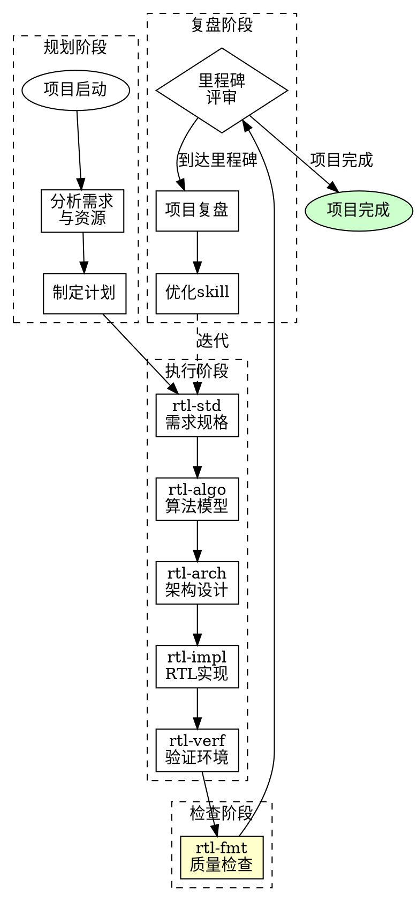
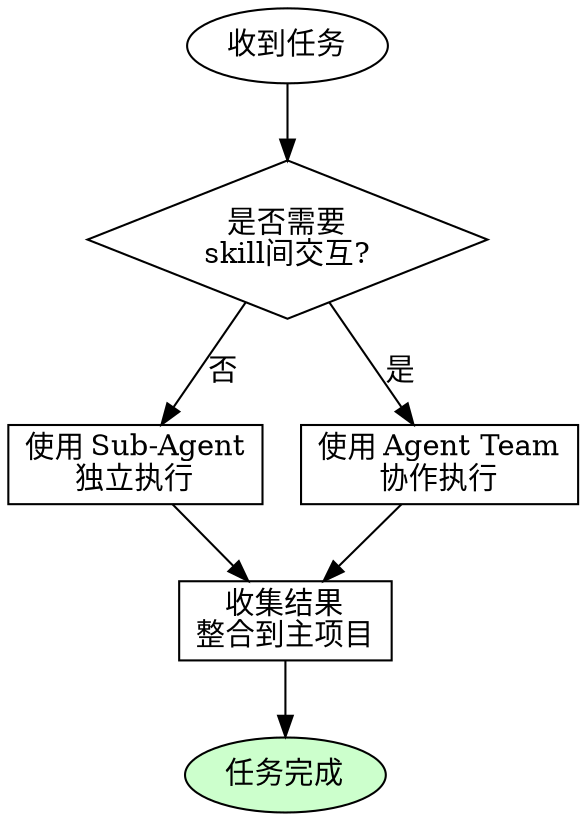
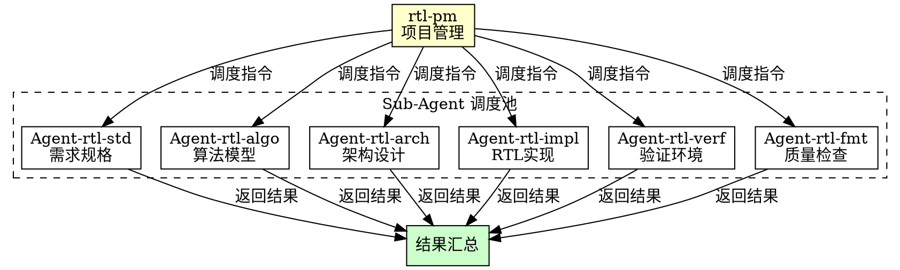
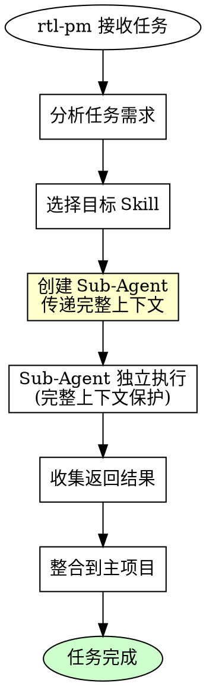
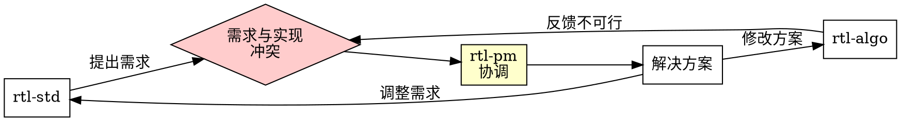
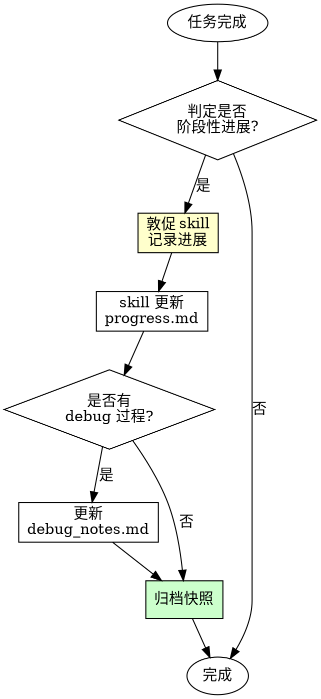
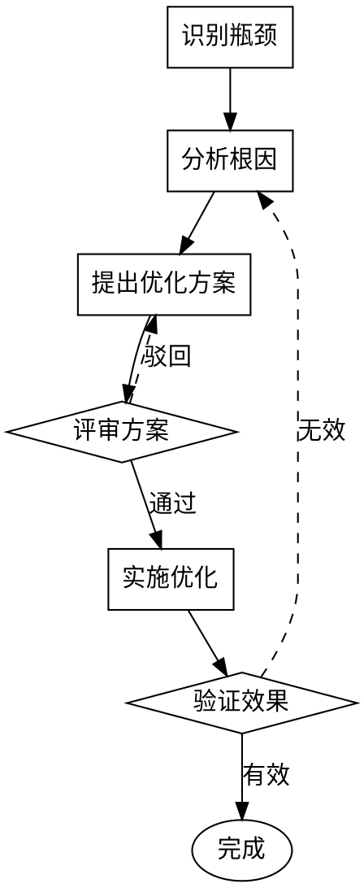

# RTL 项目管理 (rtl-pm)

## 概述

**RTL 项目总控，协调各职能 skill 高效协作。**

**核心原则：** 统一规划、合理调度、透明进度、持续优化。

本 skill 扮演项目管理角色，负责规划、调度、追踪和复盘 RTL 开发全流程。

## 职能范围

### 管理对象

| Skill | 职能 | 调度时机 |
|-------|------|----------|
| rtl-std | 需求规格 | 项目启动、需求变更 |
| rtl-algo | 算法模型 | 规格定义后、精度问题 |
| rtl-arch | 架构设计 | 规格确认后、架构优化 |
| rtl-impl | RTL实现 | 架构定稿后、代码修改 |
| rtl-verf | 验证环境 | 实现完成后、验证反馈 |
| rtl-fmt | 质量检查 | 文档产出后、定期检查 |

### 核心职责

1. **项目规划** - 制定开发计划和里程碑
2. **资源调度** - 协调各 skill 工作顺序
3. **进度追踪** - 监控任务状态和进度
4. **问题协调** - 解决跨 skill 协作问题
5. **里程碑复盘** - 分析瓶颈并优化流程
6. **Sub-Agent 调度** - 通过独立子代理调度各 skill，避免上下文丢失
7. **进度日志管理** - 督促各 skill 记录工作目标与进展，精简归档便于复盘

### 职能边界（重要）

**rtl-pm 只管"做什么"，不管"怎么做"：**

| 属于 rtl-pm 职责 | 不属于 rtl-pm 职责 |
|------------------|-------------------|
| 制定里程碑计划 | 预设流水线级数 |
| 任务分解与依赖关系 | 指定位宽/定点化方案 |
| 进度追踪与协调 | 架构技术决策 |
| 资源调度 | 验证策略制定 |
| 跨 skill 协调 | 代码实现细节 |
| **主动核对必要信息** | - |

**规划阶段的边界：**
- 可描述算法功能阶段（如"梯度计算"、"方向融合"），但**不应预设 RTL 流水线划分**
- 可列出输入输出位宽需求（来自用户），但**不应指定内部信号位宽**
- 可定义目标频率和工艺约束，但**不应指定流水级数**

流水线划分、位宽分析、定点化方案等技术决策应交给 rtl-arch 和 rtl-algo 专业 skill。

### 必要信息核对清单（主动询问）

**项目规划启动时，rtl-pm 必须主动核对以下信息，若用户未提供则逐项询问：**

| 信息类别 | 具体项 | 说明 |
|----------|--------|------|
| **数据规格** | 输入数据位宽 | 如：10-bit 无符号 |
| | 输出数据位宽 | 如：10-bit 无符号 |
| | 数据格式 | 无符号/有符号/定点 |
| **性能目标** | 目标工作频率 | 如：300MHz |
| | 吞吐量要求 | 如：1 pixel/clock |
| | 延迟要求 | 如：固定延迟或可接受范围 |
| **工艺约束** | 目标工艺节点 | 如：12nm |
| | 资源约束 | 如：面积预算、功耗预算 |
| **接口规格** | 接口协议 | 如：AXI-Stream、自定义握手 |
| | 配置寄存器需求 | 是否需要动态配置 |

**询问示例：**

```
在开始规划前，我需要核对以下信息：

1. 数据规格：
   - 输入数据位宽是多少？（如未指定，我将假设默认值）
   - 输出数据位宽是多少？

2. 性能目标：
   - 目标工作频率是多少？
   - 吞吐量要求是每时钟周期处理多少像素？

3. 工艺约束：
   - 目标工艺节点是什么？（如12nm）

请确认或补充以上信息。
```

**核对原则：**
- 不假设未提供的关键信息
- 逐项询问，避免遗漏
- 记录用户的确认结果到项目规划书

## 项目工作流



## 项目规划模板

### 项目信息

```markdown
# 项目规划书

## 基本信息
- 项目名称: [名称]
- 版本: [版本号]
- 启动日期: [YYYY-MM-DD]
- 目标交付: [YYYY-MM-DD]
- 项目经理: [姓名]

## 项目目标
[描述项目的主要目标和交付物]

## 团队角色
| 角色 | 负责人 | 职责 |
|------|--------|------|
| 项目管理 | [姓名] | 规划、协调、追踪 |
| 算法工程师 | [姓名] | 算法模型开发 |
| 架构师 | [姓名] | 架构设计 |
| RTL工程师 | [姓名] | RTL实现 |
| 验证工程师 | [姓名] | 验证环境 |
```

### 里程碑计划

```markdown
## 里程碑计划

| 阶段 | 里程碑 | 交付物 | 负责Skill | 目标日期 | 状态 |
|------|--------|--------|-----------|----------|------|
| 规划 | M0: 项目启动 | 项目规划书 | rtl-pm | [日期] | 待开始 |
| 规格 | M1: 需求基线 | 需求规格文档 | rtl-std | [日期] | 待开始 |
| 算法 | M2: 算法定型 | 定点模型+精度报告 | rtl-algo | [日期] | 待开始 |
| 架构 | M3: 架构评审 | 架构设计文档 | rtl-arch | [日期] | 待开始 |
| 实现 | M4: 代码完成 | RTL代码 | rtl-impl | [日期] | 待开始 |
| 验证 | M5: 验证通过 | 验证报告 | rtl-verf | [日期] | 待开始 |
| 交付 | M6: 项目交付 | 全部交付物 | rtl-pm | [日期] | 待开始 |
```

### 任务分解

```markdown
## 任务分解

### M1: 需求基线
| 任务ID | 任务描述 | 负责 | 前置 | 预计工时 | 状态 |
|--------|----------|------|------|----------|------|
| T1.1 | 收集算法需求 | rtl-std | - | 2d | 待开始 |
| T1.2 | 定义接口规格 | rtl-std | T1.1 | 1d | 待开始 |
| T1.3 | 算法工程师签核 | rtl-std | T1.2 | 0.5d | 待开始 |

### M2: 算法定型
| 任务ID | 任务描述 | 负责 | 前置 | 预计工时 | 状态 |
|--------|----------|------|------|----------|------|
| T2.1 | 浮点模型开发 | rtl-algo | T1.3 | 3d | 待开始 |
| T2.2 | 硬件可行性评估 | rtl-algo | T2.1 | 1d | 待开始 |
| T2.3 | 定点模型开发 | rtl-algo | T2.2 | 3d | 待开始 |
| T2.4 | 精度分析报告 | rtl-algo | T2.3 | 1d | 待开始 |

...（后续里程碑任务分解）
```

## 进度追踪

### 状态定义

| 状态 | 含义 | 颜色标识 |
|------|------|----------|
| 待开始 | 未启动 | 灰色 |
| 进行中 | 正在执行 | 蓝色 |
| 阻塞 | 遇到障碍 | 红色 |
| 待评审 | 等待审核 | 黄色 |
| 已完成 | 通过验收 | 绿色 |

### 进度报告模板

```markdown
# 项目周报

## 基本信息
- 项目名称: [名称]
- 报告周期: [开始日期] ~ [结束日期]
- 报告人: [姓名]

## 进度概览

| 里程碑 | 目标日期 | 当前状态 | 完成度 |
|--------|----------|----------|--------|
| M1: 需求基线 | [日期] | ✓已完成 | 100% |
| M2: 算法定型 | [日期] | ●进行中 | 60% |
| M3: 架构评审 | [日期] | ○待开始 | 0% |

## 本周完成
1. [任务描述] - [负责Skill]
2. [任务描述] - [负责Skill]

## 下周计划
1. [任务描述] - [负责Skill] - [预计完成日期]
2. [任务描述] - [负责Skill] - [预计完成日期]

## 风险与问题
| 问题 | 影响 | 责任Skill | 解决方案 | 状态 |
|------|------|-----------|----------|------|
| [问题描述] | 高/中/低 | [skill] | [方案] | 处理中 |

## 资源需求
- [需要的资源或支持]
```

## Skill 调度

### 调度原则

1. **依赖优先** - 有依赖关系的任务按顺序执行
2. **并行可行** - 无依赖的任务可并行调度
3. **资源均衡** - 避免单点资源过载
4. **风险前置** - 高风险任务优先处理
5. **上下文隔离** - 使用 Sub-Agent 调度，保护完整上下文

### Sub-Agent 调度机制

**核心目的：** 避免因主上下文过长或压缩导致任务信息丢失。

**问题背景：**
- 长对话中上下文会被压缩
- 压缩后关键任务细节可能丢失
- 多任务并行时信息容易混淆

**解决方案：** 每个 skill 调度通过独立 Sub-Agent 执行，拥有独立完整上下文。

**重要限制（必须注意）：**

| 限制 | 说明 |
|------|------|
| **Sub-Agent 间不能相互通信** | 各 Agent 独立执行，无法直接交互 |
| **只能汇总到 Main Agent** | 结果必须返回给 rtl-pm（Main Agent）整合 |
| **无法共享执行时状态** | 每个 Agent 只有启动时传入的上下文 |

**适用场景：**
- 任务边界清晰、可独立完成
- 不需要与其他 skill 实时交互
- 结果可以汇总整合

### Agent Team 调度机制

**何时使用 Agent Team：**

当多个 skill 需要**在执行过程中交互协作**时，应使用 Agent Team 而非独立 Sub-Agent。

| 场景 | 推荐调度方式 |
|------|--------------|
| 任务独立，无需交互 | Sub-Agent（串行或并行） |
| 需要 skill 间实时讨论 | Agent Team |
| 需要共享中间状态 | Agent Team |
| 有依赖但需要协商 | Agent Team |

**Agent Team 调用方式：**

使用 `TeamCreate` 工具创建团队，团队成员可通过 `SendMessage` 相互通信：

```
# 创建团队
TeamCreate:
  team_name: "isp-csiir-design"
  description: "ISP-CSIIR 设计团队"
  agent_type: "team-lead"

# 调度团队成员（使用 Agent 工具）
Agent:
  team_name: "isp-csiir-design"
  name: "architect"
  subagent_type: general-purpose
  prompt: [任务描述]

# 团队成员间通信（在 Agent 内部使用 SendMessage）
SendMessage:
  to: "architect"
  message: "需要确认接口位宽"
```

### 调度决策流程





### Sub-Agent 调度流程



### Sub-Agent 调度命令格式

**使用 Agent 工具调度：**

```
调用方式：使用 Agent 工具
subagent_type: general-purpose
description: "[skill-name] 任务执行"

prompt 内容：
---
你是 [skill-name] 职能代理。

## 任务描述
[完整任务描述]

## 输入信息
[所有相关输入数据、文档内容、上下文]

## 输出要求
[期望的输出格式和内容]

## 约束条件
[任何限制或要求]

请按照 [skill-name] 的职责范围完成此任务。
---
```

### 调度示例

**调度 rtl-algo 进行位宽分析：**

```
Agent 工具调用：
subagent_type: general-purpose
description: "rtl-algo 位宽分析"

prompt:
---
你是 rtl-algo（算法模型）职能代理。

## 任务描述
分析 CSIIR 模块四阶段算法的数据位宽需求。

## 输入信息
算法参考文档内容：
[完整的 isp-csiir-ref.md 内容]

当前已知条件：
- 输入数据：8bit 无符号像素
- 处理流程：Stage1-4 四阶段
- 目标：确定各阶段输入输出位宽

## 输出要求
1. 各阶段信号位宽分析表
2. 定点化格式建议（Qm.n）
3. 关键运算（除法、累加）的处理方案
4. 精度保持建议

请按照 rtl-algo 的职责完成位宽分析报告。
---
```

### 并行调度策略

**独立任务并行调度：**

当多个任务无依赖关系时，使用单个消息发起多个 Agent 调用：

```
# 并行调度示例：同时调度 rtl-algo 和 rtl-arch

[单个消息中发起两个 Agent 调用]

Agent 1:
  description: "rtl-algo 位宽分析"
  prompt: [rtl-algo 完整任务描述]

Agent 2:
  description: "rtl-arch 架构规划"
  prompt: [rtl-arch 完整任务描述]
```

### 结果收集与整合

**Sub-Agent 返回后：**

1. **检查结果完整性**
   - 是否完成所有要求的输出
   - 结果格式是否符合预期

2. **整合到主项目**
   - 更新任务状态
   - 记录产出物位置
   - 触发后续任务

3. **质量检查**
   - 调用 rtl-fmt 进行文档检查
   - 确认符合中文规范

### 上下文保护原则

| 原则 | 说明 |
|------|------|
| **完整传递** | 将任务相关的所有信息完整传递给 Sub-Agent |
| **独立执行** | Sub-Agent 在独立上下文中执行，不受主对话压缩影响 |
| **明确边界** | 清晰定义任务范围，避免越界 |
| **结果验证** | 返回结果需验证完整性和正确性 |

### 调度命令格式

```
[rtl-pm 调度指令]

目标: rtl-xxx
任务: [任务描述]
输入: [输入条件]
输出: [期望输出]
截止: [截止日期]
优先级: 高/中/低
```

### 调度示例

```
[rtl-pm 调度指令]

目标: rtl-std
任务: 完成边缘检测模块需求规格定义
输入: 算法工程师提供的Sobel算子需求
输出: 模块规格文档（接口、性能、数据格式）
截止: 2024-01-15
优先级: 高

请 rtl-std 在截止日期前完成需求规格文档，
完成后通知 rtl-fmt 进行质量检查。
```

### 跨 Skill 协调



## 进度日志管理

### 目的

**督促各 skill 记录工作进展，精简归档，便于阶段性管理与复盘。**

### 归档位置（重要）

**勒令所有项目归档记录统一保存到 `docs/` 目录，禁止记录在各 skill 目录中。**

```
docs/
└── [模块名称]/
    └── [项目编号]/
        ├── rtl-std/
        │   ├── task.md           # 任务记录
        │   ├── progress.md       # 工作进展
        │   └── debug_log.md      # Debug 思路
        ├── rtl-algo/
        │   ├── task.md
        │   ├── progress.md
        │   └── debug_log.md
        ├── rtl-arch/
        ├── rtl-impl/
        ├── rtl-verf/
        ├── rtl-fmt/
        └── rtl-pm/
            ├── task.md
            ├── progress.md
            ├── debug_log.md
            └── milestone/         # 里程碑快照
                ├── M1_snapshot.md
                ├── M2_snapshot.md
                └── ...
```

### 项目编号规则

| 情况 | 编号规则 | 示例 |
|------|----------|------|
| 未指定项目编号 | 默认从 `prj_0` 开始递进 | prj_0, prj_1, prj_2... |
| 指定项目编号 | 使用指定编号 | prj_csiir, prj_v1... |

**编号递进规则：**
1. 首次启动项目：检查 `docs/[模块名称]/` 下已有编号
2. 取最大编号 +1 作为新项目编号
3. 若无已有项目，从 `prj_0` 开始

### 日志格式规范

#### progress.md（工作目标与进展）

```markdown
# [项目名] 工作进展

## 当前阶段
- 阶段: [Mx: 名称]
- 状态: 进行中/待评审/已完成
- 更新时间: YYYY-MM-DD

## 工作目标
1. [目标1]
2. [目标2]

## 已完成
| 日期 | 任务 | 状态 |
|------|------|------|
| MM-DD | [任务描述] | ✓ |

## 进行中
| 任务 | 进度 | 预计完成 |
|------|------|----------|
| [任务描述] | [N%] | [日期] |

## 待处理
- [ ] [任务描述]
```

#### debug_log.md（Debug 思路，精简）

```markdown
# [项目名] Debug 记录

## 问题记录

### [日期] 问题标题
- 现象: [一句话描述]
- 定位: [模块/信号]
- 原因: [根因]
- 方案: [解决方法]
- 状态: 已解决/进行中

### [日期] 另一个问题
...
```

### 精简原则

| 原则 | 说明 |
|------|------|
| **控制行数** | 单次更新不超过 10 行 |
| **关键信息** | 只记录决策点、问题、方案 |
| **避免冗余** | 不重复已有文档内容 |
| **结构化** | 使用表格和列表，便于扫描 |
| **定期清理** | 里程碑后归档旧日志 |

### 阶段性进展判定

**rtl-pm 判定项目取得阶段性进展的条件：**

| 条件 | 说明 |
|------|------|
| 里程碑完成 | M1-M6 任一里程碑通过评审 |
| 重大问题解决 | 阻塞性 bug 已修复验证 |
| 功能增量完成 | 新功能模块实现并验证 |
| 架构变更落地 | 架构调整已落实到代码 |

### PM 敦促记录时机



### 敦促指令格式

```
[rtl-pm 敦促记录]

目标: rtl-xxx
项目编号: [prj_N]
触发: [里程碑完成/问题解决/功能增量]
归档路径: docs/[模块名称]/[项目编号]/[skill名称]/
要求:
1. 更新 progress.md 工作目标与进展
2. 如有 debug 过程，记录到 debug_log.md
3. 保持精简，单次更新不超过 10 行
截止: [时间]
```

### 敦促示例

```
[rtl-pm 敦促记录]

目标: rtl-impl
项目编号: prj_0
触发: M4 代码完成，验证通过
归档路径: docs/isp-csiir/prj_0/rtl-impl/
要求:
1. 更新 docs/isp-csiir/prj_0/rtl-impl/progress.md
   - 记录已完成的模块
   - 更新当前阶段状态
2. 记录 debug 过程到 docs/isp-csiir/prj_0/rtl-impl/debug_log.md
   - 列出遇到的主要问题
   - 简述解决方案
3. 保持精简，避免冗余
截止: 今日结束前
```

### 里程碑快照归档

**每个里程碑完成后，创建快照归档：**

```
docs/[模块名称]/[项目编号]/rtl-pm/milestone/
└── M[x]_snapshot.md
```

**rtl-pm 自身的归档路径：**

```
docs/[模块名称]/[项目编号]/rtl-pm/
├── task.md           # PM 任务记录
├── progress.md       # PM 工作进展
├── debug_log.md      # 协调问题记录
└── milestone/        # 里程碑快照
    ├── M1_snapshot.md
    ├── M2_snapshot.md
    └── ...
```

**快照内容：**

```markdown
# M[x] 里程碑快照

## 基本信息
- 里程碑: [名称]
- 完成日期: YYYY-MM-DD
- 负责 Skill: [skill-name]

## 主要产出
- [产出物1]
- [产出物2]

## 关键决策
| 决策点 | 选择 | 原因 |
|--------|------|------|
| [决策] | [选择] | [原因] |

## 遇到的问题
| 问题 | 解决方案 |
|------|----------|
| [问题] | [方案] |

## 后续风险
- [风险1]
- [风险2]
```

### 复盘时的日志利用

**里程碑复盘时，rtl-pm 汇总各 skill 日志：**

1. **收集各 skill 的 progress.md**
   - 路径: `docs/[模块名称]/[项目编号]/[skill名称]/progress.md`
   - 查看各阶段完成情况
   - 识别瓶颈 skill

2. **收集 debug_log.md**
   - 路径: `docs/[模块名称]/[项目编号]/[skill名称]/debug_log.md`
   - 统计问题数量和类型
   - 分析问题根因分布

3. **生成分阶段报告**
   - 问题热点分析
   - 效率提升建议

### 日志管理检查清单

- [ ] 已确定项目编号（默认 prj_0）
- [ ] 已创建 docs/[模块名称]/[项目编号]/ 目录结构
- [ ] 各 skill 子目录已创建（rtl-std, rtl-algo, rtl-arch, rtl-impl, rtl-verf, rtl-fmt, rtl-pm）
- [ ] progress.md 已初始化工作目标
- [ ] 阶段性进展后已敦促更新
- [ ] Debug 过程已精简记录到 debug_log.md
- [ ] 里程碑快照已归档到 rtl-pm/milestone/
- [ ] 旧日志已清理或归档

### 归档铁律

```
1. 禁止在各 skill 目录内记录项目日志
2. 所有归档统一保存到 docs/ 目录
3. 项目编号必须明确（默认 prj_0 递进）
4. 各 skill 有独立子目录
```

## 里程碑复盘

### 复盘时机

- 每个里程碑完成后
- 遇到重大问题时
- 项目阶段性收尾

### 复盘模板

```markdown
# 里程碑复盘报告

## 基本信息
- 里程碑: [Mx: 名称]
- 计划完成: [日期]
- 实际完成: [日期]
- 延迟天数: [N天]
- 参与人: [列表]

## 目标达成情况

| 目标 | 计划 | 实际 | 达成率 |
|------|------|------|--------|
| [目标1] | [计划值] | [实际值] | [N%] |
| [目标2] | [计划值] | [实际值] | [N%] |

## Skill 执行评估

| Skill | 任务完成度 | 执行效率 | 问题数量 | 评分 |
|-------|------------|----------|----------|------|
| rtl-std | [N%] | 高/中/低 | [N] | 1-5 |
| rtl-algo | [N%] | 高/中/低 | [N] | 1-5 |
| rtl-arch | [N%] | 高/中/低 | [N] | 1-5 |
| rtl-impl | [N%] | 高/中/低 | [N] | 1-5 |
| rtl-verf | [N%] | 高/中/低 | [N] | 1-5 |
| rtl-fmt | [N%] | 高/中/低 | [N] | 1-5 |

## 问题分析

### 问题清单
| ID | 问题描述 | 影响 | 根因 | 解决措施 |
|----|----------|------|------|----------|
| P1 | [描述] | 高/中/低 | [根因] | [措施] |

### 根因分析（5Why）
```
问题: [问题描述]
  └─ Why 1: [原因1]
      └─ Why 2: [原因2]
          └─ Why 3: [原因3]
              └─ Why 4: [原因4]
                  └─ Why 5: [根本原因]
```

## 瓶颈识别

### 开发瓶颈分析

| 瓶颈类型 | 具体表现 | 涉及Skill | 优化建议 |
|----------|----------|-----------|----------|
| 需求模糊 | 需求反复变更 | rtl-std | 加强前期沟通 |
| 精度问题 | 定点精度不达标 | rtl-algo | 增加位宽分析 |
| 架构复杂 | 设计过于复杂 | rtl-arch | 简化架构 |
| 实现困难 | 时序不收敛 | rtl-impl | 增加流水级 |
| 验证耗时 | 调试周期长 | rtl-verf | 完善golden模型 |

### 效率指标

| 指标 | 定义 | 目标值 | 实际值 |
|------|------|--------|--------|
| 需求变更率 | 变更次数/总需求数 | <10% | [N%] |
| 一次通过率 | 一次验证通过数/总测试数 | >80% | [N%] |
| Bug修复周期 | Bug发现到修复的平均时间 | <2d | [N]d |
| 返工率 | 返工任务数/总任务数 | <15% | [N%] |

## Skill 优化计划

### 优化流程



### 优化建议模板

```markdown
## Skill 优化建议

### 目标Skill
rtl-xxx

### 问题描述
[当前存在的问题]

### 优化目标
[期望达到的效果]

### 优化方案
1. [具体措施1]
2. [具体措施2]

### 预期收益
- 效率提升: [N%]
- 质量改善: [描述]

### 实施计划
- 负责人: [姓名]
- 完成日期: [日期]
- 验证方法: [方法]
```

## 项目收尾

### 交付物清单

```markdown
## 项目交付物

### 规格文档
- [ ] 需求规格文档 (rtl-std)
- [ ] 数据流伪代码 (rtl-std)

### 算法文档
- [ ] 浮点模型 (rtl-algo)
- [ ] 定点模型 (rtl-algo)
- [ ] 精度分析报告 (rtl-algo)

### 架构文档
- [ ] 架构设计文档 (rtl-arch)
- [ ] 接口定义文档 (rtl-arch)

### 实现文档
- [ ] RTL代码 (rtl-impl)
- [ ] 综合约束 (rtl-impl)

### 验证文档
- [ ] 验证环境 (rtl-verf)
- [ ] 测试计划 (rtl-verf)
- [ ] 验证报告 (rtl-verf)
- [ ] 覆盖率报告 (rtl-verf)
```

### 项目总结

```markdown
# 项目总结报告

## 项目概况
- 项目名称: [名称]
- 执行周期: [开始] ~ [结束]
- 项目状态: 成功/部分成功/失败

## 目标达成
| 目标 | 达成情况 | 说明 |
|------|----------|------|
| 功能目标 | ✓/✗ | [说明] |
| 性能目标 | ✓/✗ | [说明] |
| 交付目标 | ✓/✗ | [说明] |

## 经验教训
1. **做得好的**
   - [经验1]
   - [经验2]

2. **需要改进的**
   - [问题1]
   - [问题2]

3. **后续建议**
   - [建议1]
   - [建议2]

## Skill 效能评估

| Skill | 整体评分 | 优点 | 改进点 |
|-------|----------|------|--------|
| rtl-std | [1-5] | [优点] | [改进点] |
| rtl-algo | [1-5] | [优点] | [改进点] |
| rtl-arch | [1-5] | [优点] | [改进点] |
| rtl-impl | [1-5] | [优点] | [改进点] |
| rtl-verf | [1-5] | [优点] | [改进点] |
| rtl-fmt | [1-5] | [优点] | [改进点] |
```

## 铁律

```
1. 无规划不启动
2. 无基线不开发
3. 无验证不交付
4. 无复盘不结束
5. 调度必用 Sub-Agent 或 Agent Team（保护上下文）
6. 阶段进展必记录（精简归档）
7. Sub-Agent 间不能相互通信，需交互时使用 Agent Team
8. 独立任务用 Sub-Agent，协作任务用 Agent Team
9. 精度/时序风险必须评估，发现问题必须上报用户
```

## 关键决策审核机制（重要）

### 必须上报用户的场景

| 场景 | 说明 | 示例 |
|------|------|------|
| **精度问题** | 定点化误差 > 5% | 除5近似为除4导致25%误差 |
| **时序风险** | 可能无法收敛的设计 | 变量除法器 @ 600MHz |
| **架构偏离** | RTL 未实现架构设计 | 迭代除法器设计未落地 |
| **跨职能分歧** | skill 间意见不一致 | rtl-algo 与 rtl-arch 对方案有分歧 |

### 里程碑审核检查清单

**rtl-pm 在每个里程碑完成后，必须审核以下关键点：**

#### M2 算法定型审核

| 检查项 | 合格标准 | 当前状态 |
|--------|----------|----------|
| 定点化误差分析 | 每个近似操作误差 < 5% | □ 已验证 |
| 除法/开方操作 | 明确实现方案 | □ 已验证 |
| 精度评估报告 | 量化误差范围 | □ 已验证 |

#### M3 架构评审审核

| 检查项 | 合格标准 | 当前状态 |
|--------|----------|----------|
| 时序预算分配 | 单级 < 70 FO4 @ 12nm | □ 已验证 |
| 变量除法方案 | 明确迭代除法器或近似方案 | □ 已验证 |
| 设计与实现一致性 | 架构方案可落地到 RTL | □ 已验证 |

#### M4 RTL 实现审核

| 检查项 | 合格标准 | 当前状态 |
|--------|----------|----------|
| 架构设计落地 | RTL 实现与架构文档一致 | □ 已验证 |
| 变量除法实现 | 使用迭代除法器，非直接 `/` | □ 已验证 |
| 时序关键路径 | 无组合逻辑除法器 | □ 已验证 |

#### M5 验证通过审核

| 检查项 | 合格标准 | 当前状态 |
|--------|----------|----------|
| Golden Model 一致性 | RTL 输出与定点模型一致 | □ 已验证 |
| 边界条件覆盖 | 首行、尾列、极值输入 | □ 已验证 |

### 问责机制

**当发现以下问题时，rtl-pm 必须问责相关 skill：**

| 问题类型 | 问责对象 | 处理方式 |
|----------|----------|----------|
| 精度评估缺失/错误 | rtl-algo | 记录到 debug_log.md，要求补充分析 |
| 架构设计未落地 | rtl-arch + rtl-impl | 协调对齐，必要时回滚重新设计 |
| 变量除法直接用 `/` | rtl-impl | 要求改为迭代除法器或近似方案 |
| 验证未发现问题 | rtl-verf | 要求补充测试用例 |

**rtl-pm 对项目整体负责，协调各 skill 高效协作。**